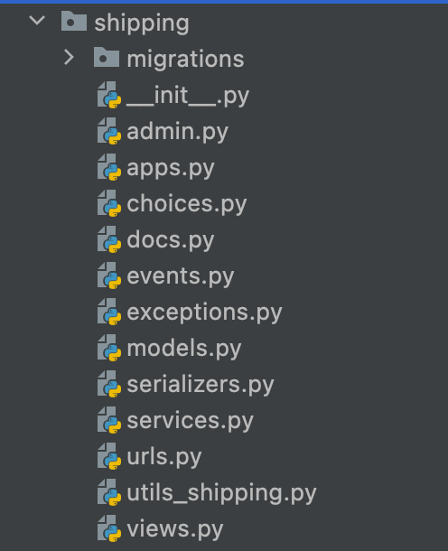

# conventions and styleguide
Inspired by [Django-Styleguide](https://github.com/HackSoftware/Django-Styleguide)
Here's few convention we are using for this project

## import
### top of the file
Import in following order and alphabetical
1. standard python library
2. django package
3. third-party package
4. core module
5. local model

```

EX)
import datetime
import logging

from django.apps import apps
from django.conf import settings
from django.contrib.auth import get_user_model
from django.utils.translation import gettext_lazy as _

from phonenumber_field.serializerfields import PhoneNumberField
from rest_framework import serializers

from core.exceptions import FieldValidationError
from core.utils import clean_phonumber_for_national_str

from .choices import ShippingItemStatus
from .models import ShippingItem
from .serializers import ShippingItemSerializer
from .utils_shipping import generate_batch_alias, generate_tracking_number

```
### Local import
- try to use local import for modules from other domain. It's easier to decouple.
```
class ShippingExampleSerializer(serializers.Serializer)
    def validate(self, attrs):
        from user.selectors import get_active_users
        users = get_active_users()

        return users
```

## settings

Everything should be included in base.py.
There should be dedicating setting file for each environment importing base file.
`app.py` consists of application specific settings.
There should be nothing that's only included in <env>.py.
`secrets.py` should only include Environment Variables.
settings/packages/*.py include 3rdpart specific settings.

## module structures
### modules


Each module consists of following structure
- admin: django admin
- apps: Django App Config
- choices: Enum files used in module
- docs: yasg doc
- events: events emitted from django module
- exceptions: Custom exceptions
- models: Ordinary django models
- manager: Queryset managers
- serializers: DRF serialiers
- selectors: Query that requires join
- services: Biz logics for domain
- schema: api or model schema for testing
- urls: django url resolver
- utils_*: utils method
- views: DRF views

### core module
Core module consists of common modules that can be extended for each module

## logger
Using Django logger, output will be formatted using `ECSformatter` for search indexing.
Logger also sends exception trace to slack using `DmmSlackExceptionHandler`.
```
import logging
logger = logging.getLogger("django.eventlogger")
logger.error(f"error sending event error {e}")

```


## decoupled join
TBD - If models are in different domain, use selector/caches to gain reference_id to fetch data.

## Async tasks
All async tasks should triggered via event emitter through eventbridges
### event emitter
```
ShippingEventsEmitter().item_added_to_batch({
    "item_tracking_number": item.tracking_number,
    "batch_alias": self.dto.batch.alias
}
```
### heartbeat
TBD - using eventbridge schedule with lambda to invoke heartbeat api
```
```
## DRF
### Throttling
[Throttling](https://www.django-rest-framework.org/api-guide/throttling/)
refer to predefined [throttlling class](majestic-monolith-django/core/throttling.py).

### Pagination

create or change default pagination behavior by editing following class
in core/pagination.py
```
class MMDPageNumberPagination(PageNumberPagination):
    page_size_query_param = "page_size"

    def get_paginated_response(self, data):
        return Response(OrderedDict([
            ('count', self.page.paginator.count),
            ('next', self.get_next_link()),
            ('previous', self.get_previous_link()),
            ('current_page', self.page.number),
            ('items_per_page', self.page_size),
            ('results', data)
        ]))
```
update settings/packages/rest.py
```
    "DEFAULT_PAGINATION_CLASS": "core.pagination.MMDPageNumberPagination",

```
