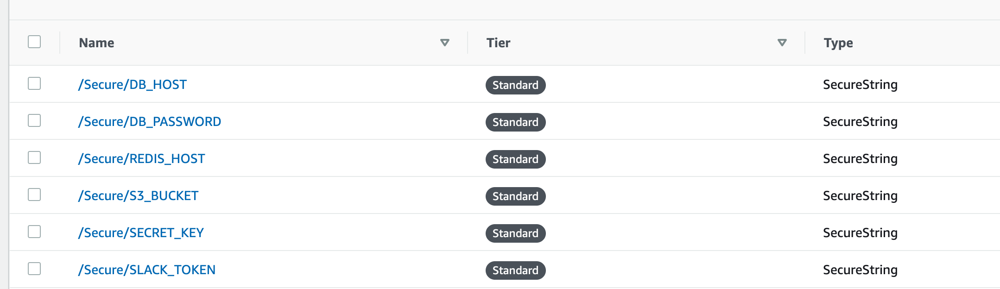

# Infra setup
We use CDK v2.
[CDK getting started](https://docs.aws.amazon.com/cdk/v2/guide/getting_started.html)

## configure aws credential
```
aws configure

```

## install CDK
```
python -m pip install aws-cdk-lib
npm install -g aws-cdk

```

## IAM - service linked role
When you are deploying using AWS CLI,
You must configure permissions to allow an IAM entity (such as a user, group, or role) to create, edit, or delete a service-linked role.
Follow instruction (Create the service-linked role)[https://docs.aws.amazon.com/AmazonECS/latest/developerguide/using-service-linked-roles.html#create-service-linked-role].


## Bootstrap
```
cdk bootstrap aws://ACCOUNT-NUMBER/REGION

```
## Prerequisite
### key-pair
you need to create ec2 key-pair for bastion ec2 intance.
https://<region>.console.aws.amazon.com/ec2/v2/home#KeyPairs:
```
export KEY_NAME="" # default key name is mmd-cdk-key-pair
```

### SSM Parameter Store
You need to create SSM parameter for following values on the
[AWS console](https://ap-northeast-2.console.aws.amazon.com/systems-manager/parameters/?tab=Table)
```
/Secure/DB_HOST
/Secure/DB_PASSWORD
/Secure/REDIS_HOST
/Secure/S3_BUCKET
/Secure/SECRET_KEY
/Secure/SLACK_TOKEN

```


## deploy CDK
```
cd <project root>/cdk/mmd-app/
cdk diff --profile 0000
cdk synth --profile 0000
cdk deploy --profile 0000
```
### push docker image to ECR
you need to push docker image to ECR repository(created from the cdk deploy in order to complete the ecs deploy task.
otherwise, ecs task won't be able to launch successfuly.

Login to ecr
```
aws ecr get-login-password --profile=<profile> --region <region> | docker login  --username AWS --password-stdin <account>.dkr.ecr.<region>.amazonaws.com
```

Nginx docker image
```
docker build -t <account_id>.dkr.ecr.<region>.amazonaws.com/nginx:lastest -f config/docker/Dockerfile_nginx .
docker push <account_id>.dkr.ecr.<region>.amazonaws.com/nginx:lastest
```
API docker image
```
docker build -t <account_id>.dkr.ecr.<region>.amazonaws.com/mmd-server:lastest -f config/docker/Dockerfile .
docker push <account_id>.dkr.ecr.<region>.amazonaws.com/mmd-server:lastest
```


## destroy stack
```
cdk destory
```
